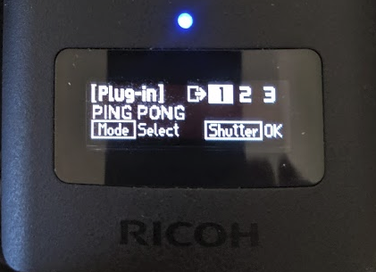
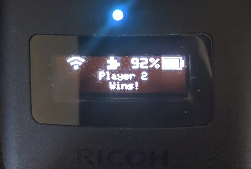

# KA-2's OLED Samples for RICOH THETA Z1

Examples from this article:

https://qiita.com/KA-2/items/b16fd6adc6db7db0fb8e

There are three branches:

* master - screensaver
* bitmap - for bitmap graphics
* pingpong - for ping pong game

## Graphics Library

The demos make use of the Oled.java library from KA-2.
https://gist.github.com/codetricity/53c4d8ef746536d900cd6b1d4134da70

## Screensaver

## Bitmap graphics

company logo example from JPG file.

## Ping Pong 

