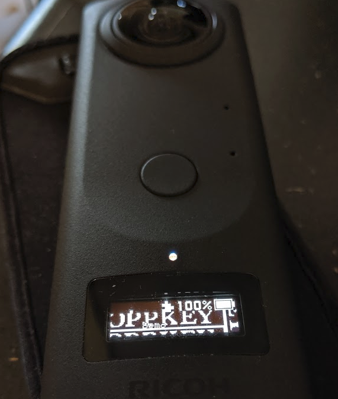
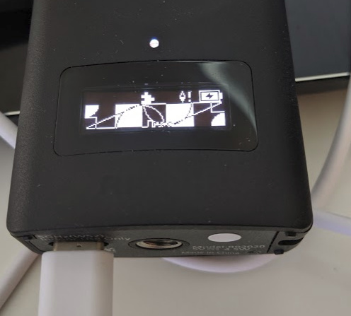
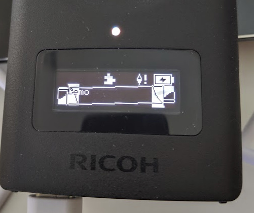
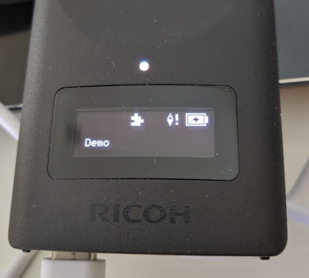
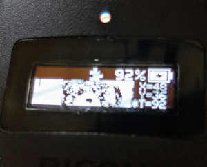
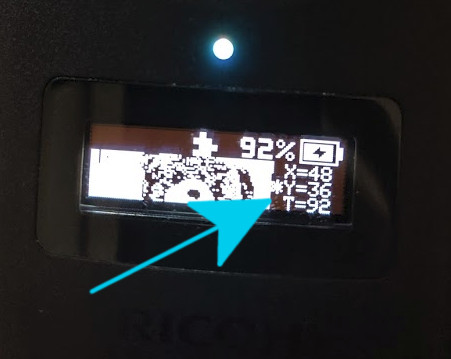
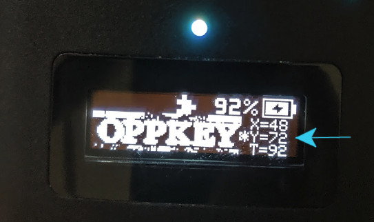

# KA-2's Bitmap Demo and Screensaver

Example from this article:

https://qiita.com/KA-2/items/b16fd6adc6db7db0fb8e

## Usage Bitmap Demo

First screen will be screensaver.

Long-press Wi-Fi button to put into Bitmap demo mode.

Long press Function button to move between "x", "y", and "t".

Short press Wi-Fi and mode to adjust x, y, t values.

Short press function to swap pixel values. 

