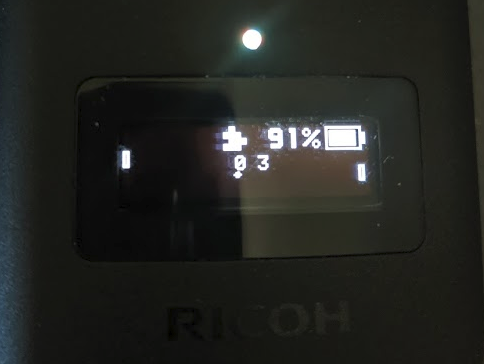

# KA-2's OLED Ping Pong Example for RICOH THETA Z1

Examples from this article:

https://qiita.com/KA-2/items/b16fd6adc6db7db0fb8e

There are three branches:

* master - screensaver
* bitmap - for bitmap graphics
* ping pong

## Graphics Library

The demos make use of the Oled.java library from KA-2.
https://gist.github.com/codetricity/53c4d8ef746536d900cd6b1d4134da70

